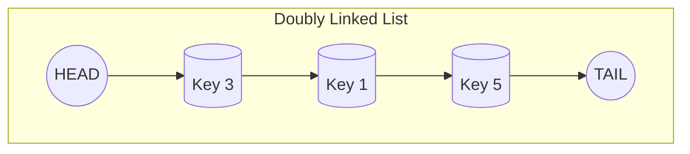
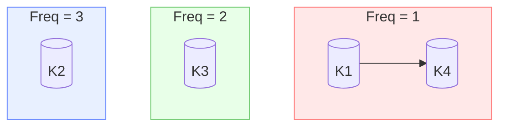
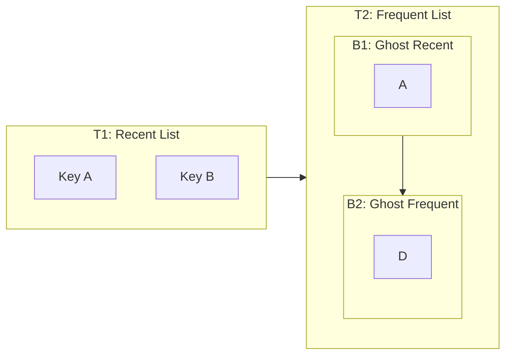
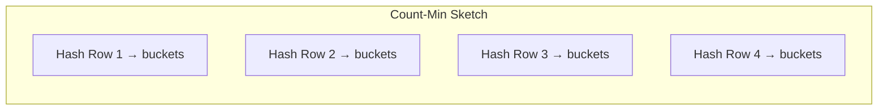
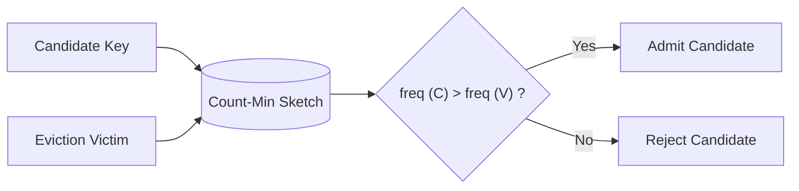
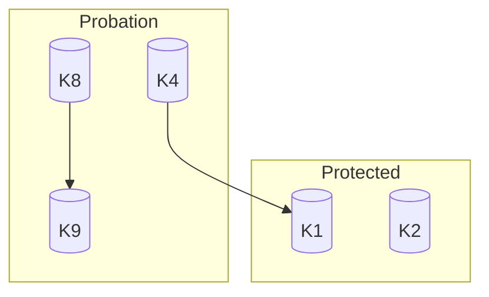
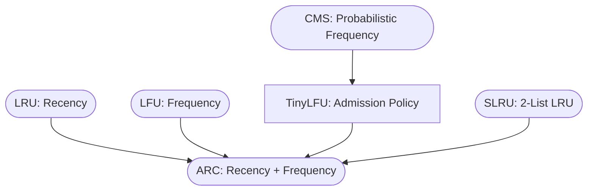

# Cache Algorithm Diagrams (Mermaid)

This document contains conceptual diagrams for all cache eviction and admission algorithms implemented in this repository.
All diagrams use **Mermaid**, supported natively by GitHub.

## #️⃣ 1. LRU Cache (Least Recently Used)

LRU maintains a **doubly linked list** where:
- **Head = Most Recently Used**
- **Tail = Least Recently Used**
- On GET/PUT → move node to head
- When full → evict from tail

### LRU Structure



---

## #️⃣ 2. LFU Cache (Least Frequently Used)

LFU uses:
- A **frequency map**
- Multiple doubly linked lists (one per frequency)
- A pointer to minFreq

### LFU Multi-List Structure



---

## #️⃣ 3. ARC (Adaptive Replacement Cache)

ARC maintains **four lists**:
- **T1**: recent items
- **T2**: frequently used
- **B1**: ghost entries for T1
- **B2**: ghost entries for T2

ARC dynamically adjusts a parameter p to balance recency vs. frequency.

### ARC Layout



---

## #️⃣ 4. Count–Min Sketch

CMS is a probabilistic estimator using a **DxW matrix** where each row is hashed differently.

### Count–Min Sketch Matrix



---

## #️⃣ 5. TinyLFU Admission Policy

TinyLFU’s logic:

```text
admit(candidate) if freq(candidate) > freq(victim)
```

It uses CMS for approximate frequency estimation.

### TinyLFU Flow



---

## #️⃣ 6. Segmented LRU (SLRU)

SLRU uses:
- **Probation Segment**: new entries
- **Protected Segment**: frequently accessed entries
- Promotion occurs on second hit.

### SLRU Two-Segment Architecture



---

## #️⃣ 7. Full High-Level Comparison


