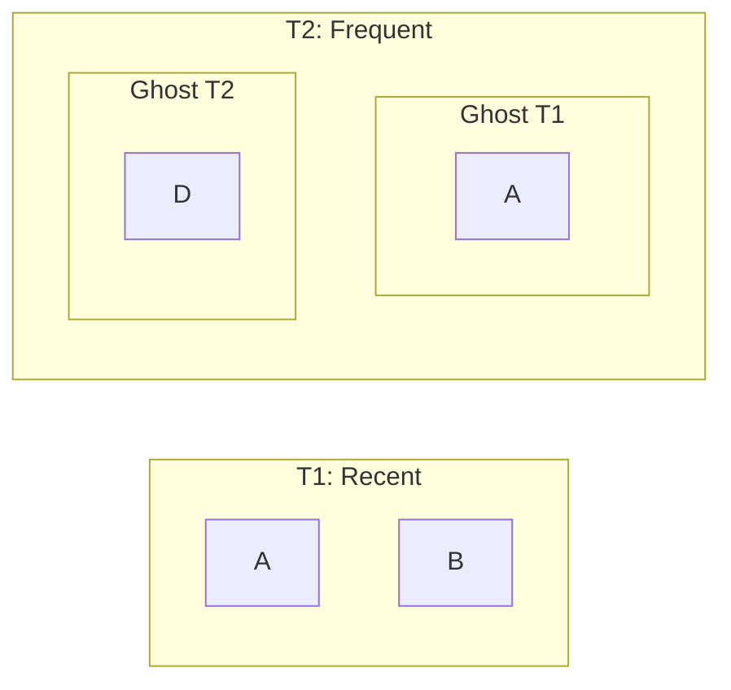

# ARC — Adaptive Replacement Cache

ARC is a self-tuning cache algorithm created by IBM Research.  
It outperforms LRU and LFU across *all* workloads.

---

## 🎯 Why ARC?

ARC adapts between:

- **Recency (LRU behavior)**
- **Frequency (LFU behavior)**

using ghost lists to learn from evictions.

---

## 🧠 Components

- T1: recent entries
- T2: frequent entries
- B1: ghost of T1
- B2: ghost of T2
- `p`: balancing factor

---

## 📐 Diagram

---

## ⭐ Highlights

- Fully self-optimizing
- Handles scans gracefully
- Superior hit rate vs LRU/LFU
