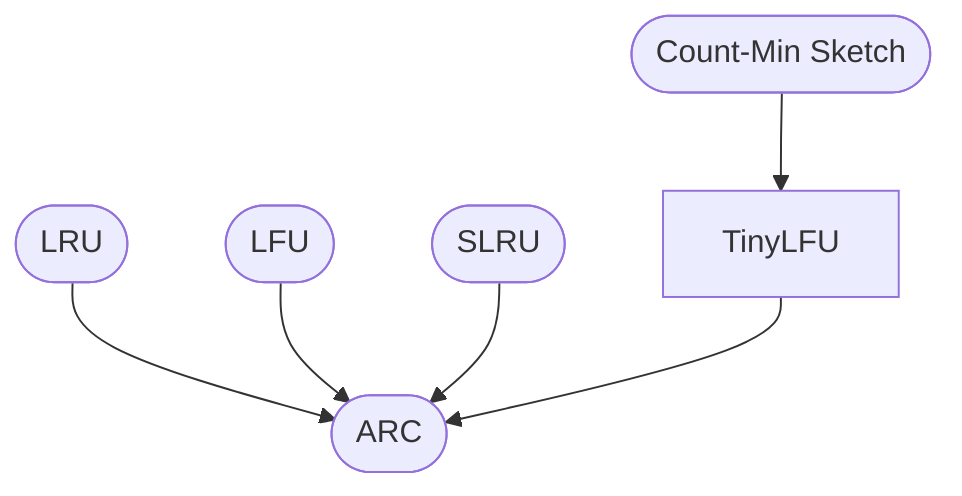

# System Architecture

This repository implements a suite of eviction + admission algorithms.

---

## 🧱 Architecture Diagram

---

## Layers

- **Eviction policies**: LRU, LFU, ARC, SLRU
- **Admission policies**: TinyLFU
- **Frequency estimation**: CMS

Together they form the foundation of modern cache design.
