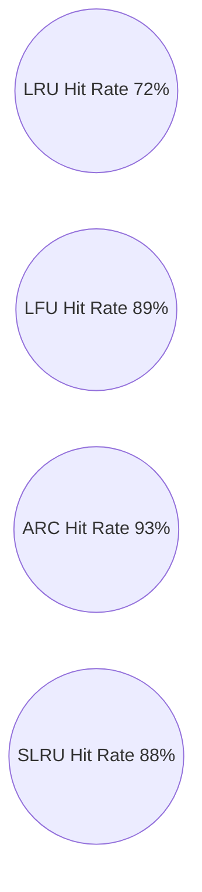

# Benchmarks

Benchmarks compare hit rates across algorithms under different workloads.

---

## 📊 Workload Types

- Sequential scan
- Looping (hotset)
- Zipfian distribution
- Mixed read/write

---

## 📈 Example Chart (Mermaid)

---

## Running Benchmarks

Coming soon: `npm run benchmark`
