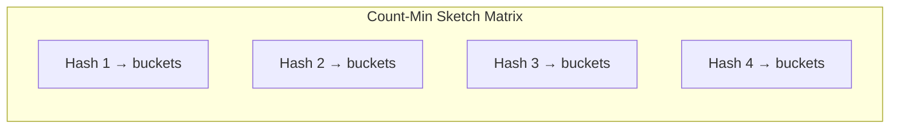

# Count–Min Sketch

CMS is a probabilistic frequency estimator used at scale (CDNs, databases, TinyLFU, Redis Streams).

---

## 🔍 Key Features

- Sub-linear memory
- Probabilistic (overestimates only)
- Fast: O(1) updates and queries

---

## 📐 Diagram

---

## 👍 Strengths

- Scalable to billions of keys
- No need to store actual keys
