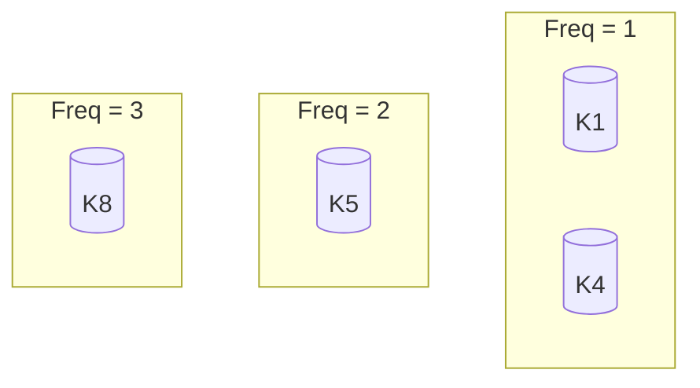

# LFU Cache

LFU (Least Frequently Used) evicts the item used the *fewest* times.

---

## 🔍 How LFU Works

- Each item has a frequency counter
- Items with lowest frequency get evicted
- Ties resolved by recency (LRU within each frequency group)

---

## 🧠 Data Structures

- Hash map of keys
- Hash map of frequencies → doubly linked lists
- Track `minFreq`

---

## 📊 Diagram

---

## 📦 Strengths

- Excellent under repeated-key workloads
- Differentiates "hot" vs "cold" data

## ⚠️ Weaknesses

- Slow adaptation
- Frequency often grows without bound
