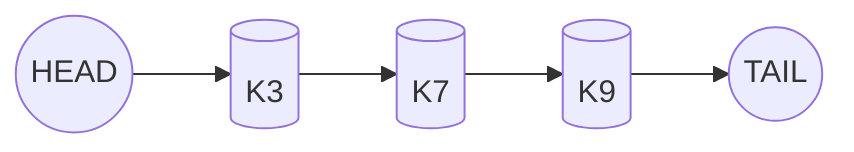

# LRU Cache

LRU (Least Recently Used) is one of the simplest and most widely used eviction policies.

---

## 🔍 What is LRU?

LRU evicts the item that was used **least recently**.  
It approximates temporal locality — the assumption that recently accessed data is likely to be accessed again.

---

## 🧠 Core Concepts

- Doubly linked list maintains recency order
- Hash map gives O(1) access
- On GET/PUT → move node to head
- Evict from the tail (LRU end)

---

## 🧩 Architecture Diagram



---

## 🧪 Example Usage

```ts
const cache = new LRUCache(2);
cache.put(1, 100);
cache.put(2, 200);
cache.get(1); 
cache.put(3, 300); // evicts key 2
```

## 📦 Strengths

- Very simple
- O(1) operations
- Great under sequential workloads

## ⚠️ Weaknesses

- Fails under **scan workloads**
- Can't differentiate frequent vs. recent
