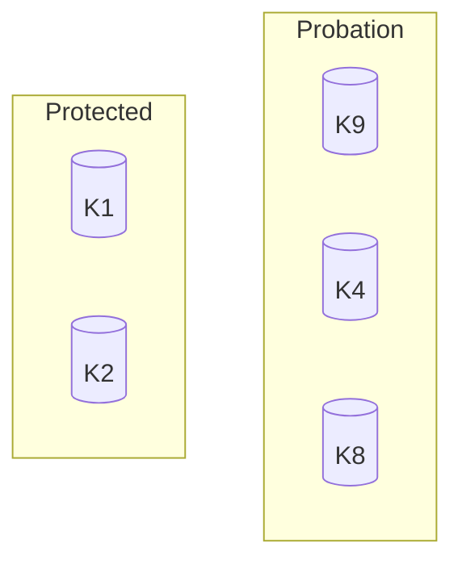

# Segmented LRU (SLRU)

SLRU divides the cache into two segments:

- **Probation**: newly inserted entries
- **Protected**: entries that survived at least one hit

---

## 🧠 How It Works

- New items → Probation
- Second access → promote to Protected
- Evictions come from Probation
- High-hit items remain protected

---

## 📊 Diagram

