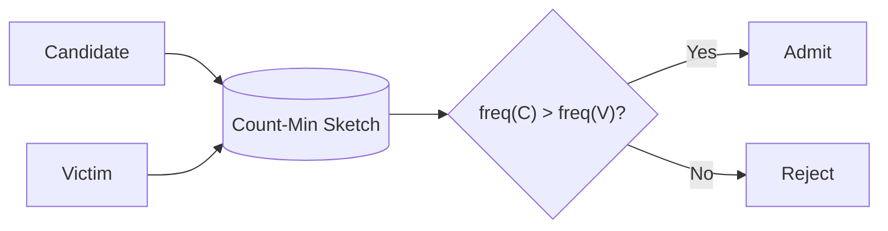

# TinyLFU — Modern Admission Policy

TinyLFU is used by Google’s **Caffeine** cache.  
It decides whether *new items should be cached at all*.

---

## 🔍 Logic

```bash
admit(candidate) if freq(candidate) > freq(victim)
```

---

## 📊 Diagram


